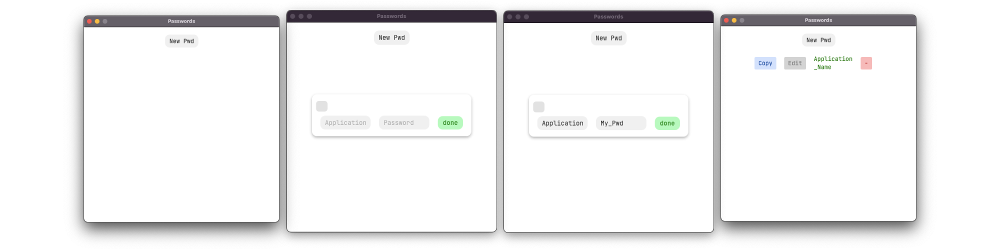

# NotSoSafePasswordManager


>[!TIP]
>As the deprecated trash that is javaFX doesn't want to compile into a working jar, if for any reason you want to use this application, you will have to run it using the following command in the project's root :   
>
>``` ./mvnw javafx:run```


## Screenshots :

